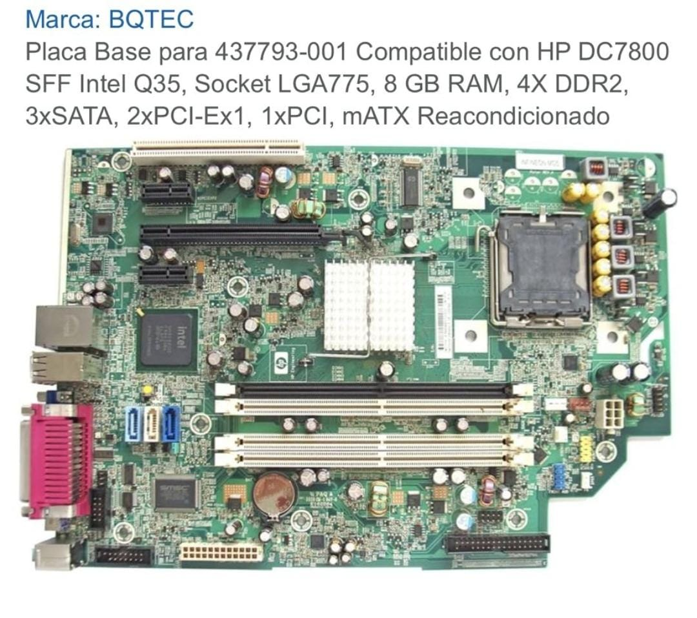
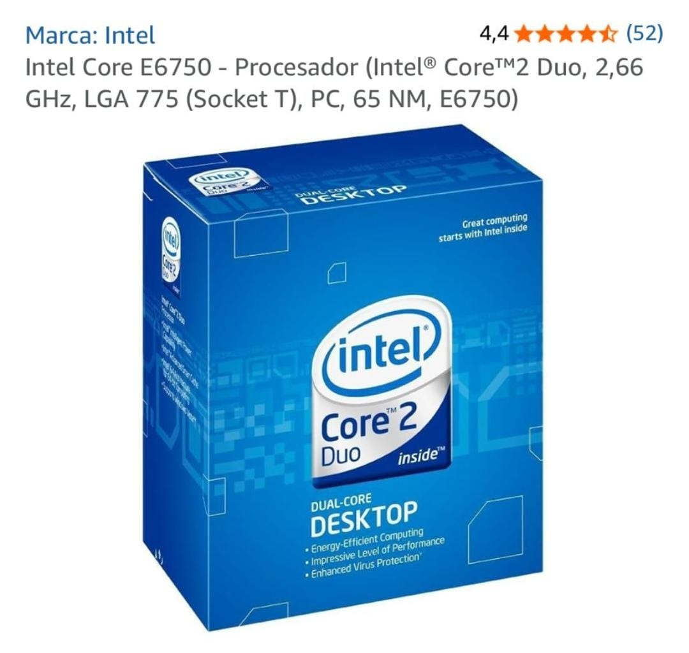
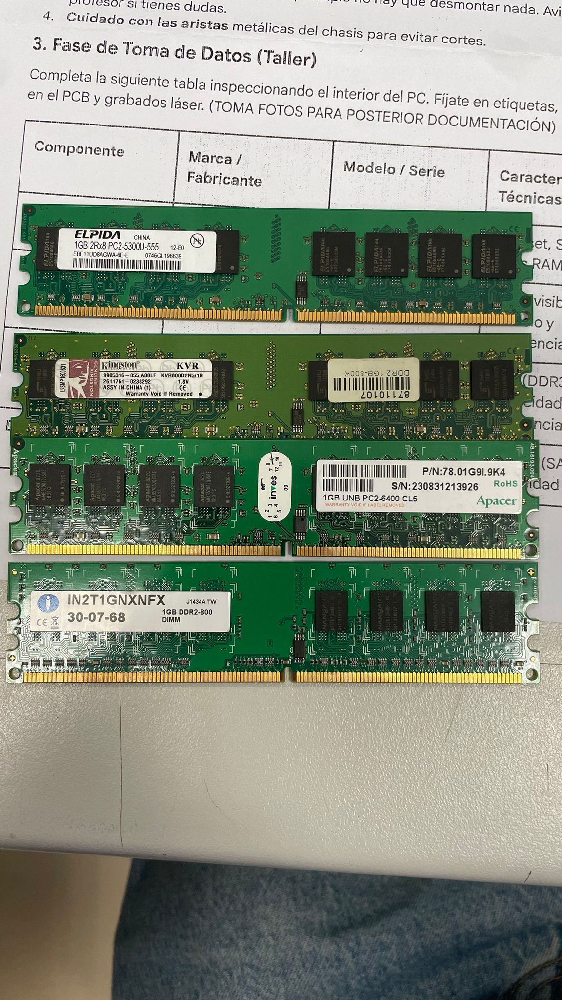
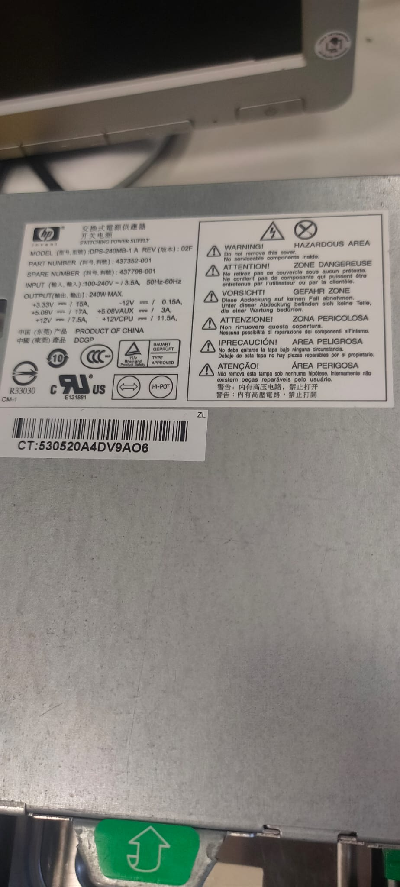

# 10 — Toma de datos (taller)

| Componente | Marca/Fabricante | Modelo/Serie | Características técnicas visibles | Foto |
|---|---|---|---|---|
| **Placa base** | **HP Engineer** | **Compact DC 7800 (versión SFF)** | Chipset **Intel Q35** / Socket **LGA775**/ Nº slots RAM **x4 DDR2** |  |
| **Microprocesador** | **IntelCore 2 duo** | **E6750** | (Si es visible) Modelo / Frecuencia **2.66GHz** |  |
| **Memoria RAM** |  |  | Tipo (DDR3/4/5), Capacidad, Frecuencia |  |
| **Disco HDD/SSD** |  |  | Interfaz (SATA/M.2), Capacidad |  |
| **Fuente de alimentación** |  |  | Potencia (W), Certificación (80+) |  |
| **Otros (GPU/Tarjetas)** |  |  |  |  |
