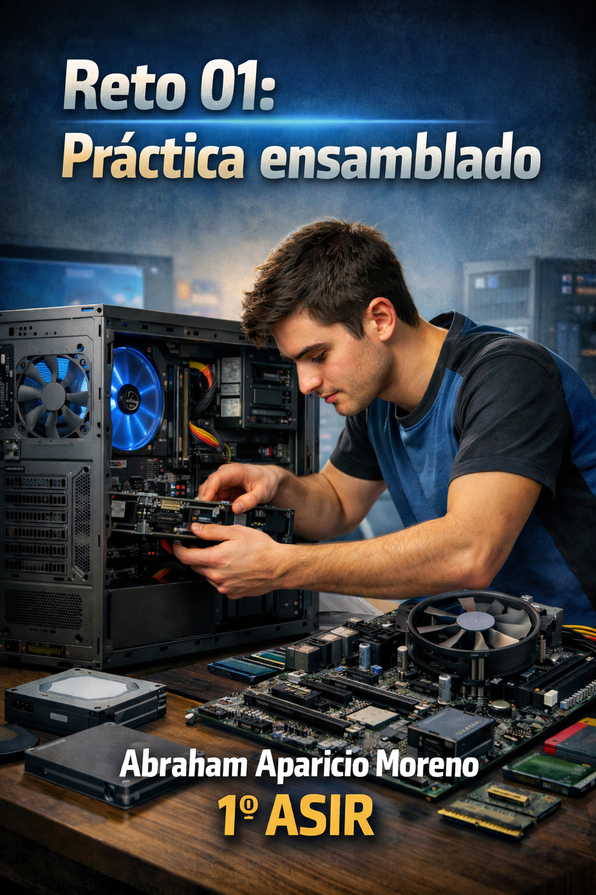

# 90 — ENTREGA ÚNICA (consolidado)

## IndiceO
1. [Portada](00-portada.md)
2. [Instrucciones](02-instrucciones.md)
3. [Toma de datos en taller](10-toma_de_datos/plantilla_tabla_taller.md)
4. [Investigación técnica](20-investigacion_tecnica/plantilla_investigacion.md)
5. [Mercado y recambios](30-mercado_y_recambios/plantilla_recambios.md)
6. [Observaciones personales](40-observaciones/plantilla_observaciones.md)
7. [ENTREGA ÚNICA](90-ENTREGA_UNICA.md)
8. [Checklist](99-entrega_y_checklist.md)
## Toma de datos — resumen

| Componente | Marca/Fabricante | Modelo/Serie | Características técnicas visibles | Foto |
|---|---|---|---|---|
| **Placa base** | **BQTEC** | **Compact DC 7800 (versión SFF)** | Chipset **Intel Q35** / Socket **LGA775**/ Nº slots RAM **x4 DDR2** |  |
| **Microprocesador** | **IntelCore 2 duo** | **E6750** | (Si es visible) Modelo / Frecuencia **2.66GHz** |  |
| **Memoria RAM** | Variados | Variados | Tipo **DDR2**, Capacidad **1GB x4**, Frecuencia **667MHz** |  |
| **Disco HDD/SSD** | **Samsung** | **HD161GJ** | Interfaz **SATA**, Capacidad **160GB** |  |
| **Fuente de alimentación** | **HP** | **DPS-240MB-1** | Potencia (W) **240**, Certificación (80+) **X** |  |
| **Otros (GPU/Tarjetas)** | **Belkin** | **A+G** | **2.4GHz ancho de banda/ Certificación FCC(Federal Communication Commission) de clase B** |  |

## Investigación técnica — resumen

## 1) Detalles del procesador
- **Modelo exacto:** **Core 2 Duo E6750**
- **Núcleos/Hilos:** 2 
- **TDP:**  65Watt
**Respuesta:** **frecuencia base 2.65 GHz y máxima de 2.67 GHz**

## 2) Soporte de memoria (según placa base)
- **Modelo exacto de placa:** **BQTEC 437793-001**
- **Capacidad máxima RAM:**  **8GB**
- **Velocidad máxima soportada:**  **solo soporta DDR2**

## Recambios — resumen

- **Componente a sustituir:** **Fuente de alimentacion** 
- **¿Existe el mismo modelo exacto en tiendas?** (Sí / No / Solo segunda mano): **Sí**   
- **Precio aproximado (€):** **75,00€** 
- **URL:**  **https://pcxeon.com/es/hp/39545-fuente-de-alimentacion-hp-compaq-dc7800-sff-series-240w-437352-001-437798-001-5712505384978.html**
- **Captura:** 

- **Componente a sustituir:**  **Disco Duro**
- **¿Existe el mismo modelo exacto en tiendas?** (Sí / No / Solo segunda mano): **Sí**  
- **Precio aproximado (€):**14,00€ +Gastos de envío** 
- **URL:**  **https://www.ebay.es/p/109089011**
- **Captura:** 

- **Componente a sustituir:** **Memoria RAM** 
- **¿Existe el mismo modelo exacto en tiendas?** (Sí / No / Solo segunda mano): **Segunda Mano** 
- **Precio aproximado (€):**  **7,00€ + Gastos de envío**
- **URL:**  **https://es.wallapop.com/item/4x-hp-4gb-ddr2-667mhz-memoria-ram-1183375565?srsltid=AfmBOoq5AhZdvJh6qi1JT6W8FJHRRDw432FXLZ5VeOBjEIQtBea7PZ1MhG0**
- **Captura:** 

## Observaciones — resumen

- Observación 1: Algo de polvo residual en las piezas de la máquina
- Observación 2: Los cables podrían estar mejor gestionados pero mayormente correctos
- Observación 3: Componentes que rozan lo legacy

